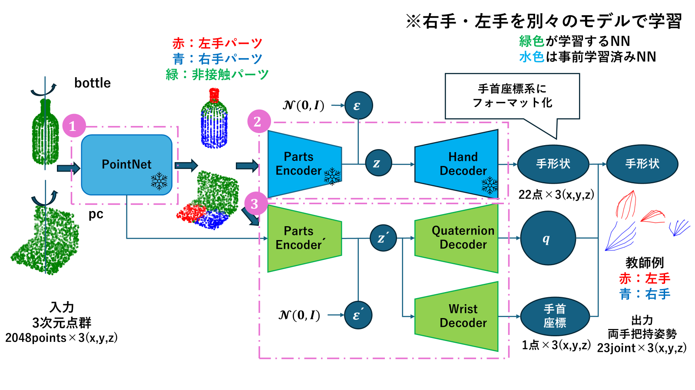
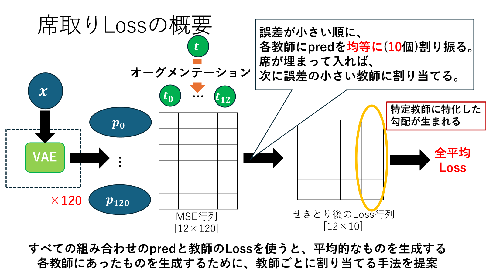
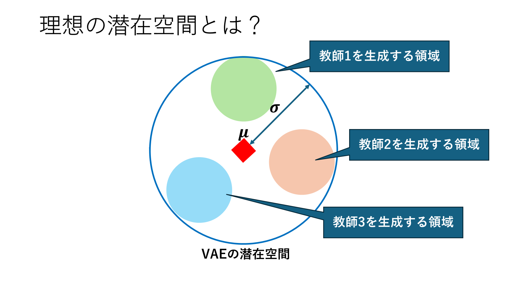

# Shape2Gesture_GenerationModel

接触部位形状を介した、両手把持姿勢の生成モデル

## 研究背景
学部では、「接触部位形状を介した、全体形状と両手把持ジェスチャの相互検索システム：https://github.com/yu0225dayo/Shape2Gesture_SearchModel」を構築した。
相互検索システムではDBが不可欠であるため、本プロジェクトではDBなしで直接生成できる生成モデルに拡張する。

## 提案手法

### モデル構造

物体の接触部位形状から手首座標系の手形状を生成するVAEと、手首座標と手の向きを生成するVAEにモデルを分離させて学習するフレームワークを提案する。
単一Decoderで生成すると、手形状が崩壊する問題に直面したため、学習・生成の安定化を図るため分離する。

### 損失関数(席取りLoss)

ボトル形状など対称性のある形状は、把持方向が無数に存在する。あらゆる方向の把持姿勢が生成されることが理想であるため、VAEの潜在空間を拘束する必要がある。
VAEは確率的分布であることから出力にランダム性が生まれる。その領域を拘束するというLossを提案


## 主な特徴

- ✅ **分離されたモデル構造**: 手形状生成VAEと位置・向き生成VAEに分離し学習・生成の安定化
- ✅ **損失関数**: 席取りLossを提案し、VAEの潜在空間を拘束

## プロジェクト全体の流れ

このリポジトリは、**2つのプロジェクト**から構成されています：

### 各プロジェクトの詳細

#### 1️⃣ utils_Pretrained_Hand/ - 手首座標系の手形状生成VAEの事前学習

**目的**: 手形状を生成するVAEを事前学習
手形状は、手首座標系・中指までの骨格長を0.5・親指の向きを[1,0]に平行・[1,0,0]を向くように標準化

#### 2️⃣ utils_Hand_Generation/ - 物体座標系における手の位置・向き生成VAEの学習

**目的**: 事前学習したモデルを転移学習させ、物体座標系に変換するVAEを生成
手の位置・向きは互いに依存していると考えられるため、同一の潜在変数zからそれぞれを生成する

## プロジェクト構成

```
Shape2Gesture_GenerationModel/
│
├── utils_Pretrained_Hand/                        # 【Step 1】手首座標系の手形状生成VAE事前学習
│   ├── dataset_format_xy.py                      # データセット読み込み (XY形式)
│   ├── dataset_format2.py                        # データセット読み込み (別形式)
│   ├── model.py                                  # HandVAEモデル定義
│   └── model_pointnet.py                         # PointNetモデル
│   │
│   ├── pretrained_HandVAE_format_xy.py           # 手形状VAE学習 (XY形式)
│   ├── pretrained_HandVAE_format2.py             # 手形状VAE学習 (別形式)
│   ├── test_pretrained_HandVAE_format_xy.py      # 学習済みモデルテスト (XY形式)
│   ├── test_pretrained_HandVAE_format2.py        # 学習済みモデルテスト (別形式)
│   └── visualization.py                           # 3D可視化関数
│
└── utils_Hand_Generation/                        # 【Step 2】物体座標系における把持姿勢生成モデル学習
    ├── dataset_format_xy.py                      # データセット読み込み (標準形式)
    ├── dataset_with_batchsampler.py              # バッチサンプラー対応データセット
    ├── model.py                                  # HandVAE, PartsEncoder, PositionVAEモデル定義
    └── model_pointnet.py                         # PointNetセグメンテーション
    │
    ├── train_PartsEncoder.py                     # パーツエンコーダ学習【Phase 1】
    └── train_PartsEncoder_target.py              # パーツエンコーダ学習（別実装）
    ├── train_positionVAE_sekitori.py             # 位置・向きVAE学習（席取りLoss）【Phase 2: 位置・向きVAE学習】
    ├── train_positionVAE_sekiori_worst.py        # 位置・向きVAE学習（下位30%で学習）
    └── train_positionVAE_w_batchsampler.py       # 位置・向きVAE学習（バッチサンプラー版）★推奨
    │
    ├── visualize_method.py                       # 生成結果の可視化（標準版）
    ├── visualize_method_w_sampler.py             # 生成結果の可視化（サンプラー版）
    ├── show_g2p_target.py                        # ジェスチャー→パーツ可視化（教師信号）
    ├── show_g2p_sampling.py                      # ジェスチャー→パーツ可視化（サンプリング版）
    ├── show_pca_selected_labels.py               # PCA結果表示
    └── makevideo.py                              # 生成結果から動画生成
    │
    ├── functions_loss.py                         # 損失関数群（席取りLoss等）
    ├── functions_pointnet.py                     # PointNetユーティリティ関数
    ├── functions_pointnet_demo.py                # PointNetデモ用関数
    ├── funtion_else.py                           # その他ユーティリティ関数
    ├── caclulate_method.py                       # 評価指標計算関数
    ├── calc_chamfer.py                           # Chamfer距離計算
    └── visualization.py                          # 3D可視化関数
```

### utils_Pretrained_Hand/ の詳細

**目的**: 手首座標系における手形状を生成するVAEの事前学習

手形状は以下のように標準化されます:
- 手首座標系での定義
- 中指までの骨格長: 0.5
- 親指の向き: [1,0]に平行
- 向き: [1,0,0]を向く

**主要ファイル**:
| ファイル | 役割 |
|---------|------|
| `pretrained_HandVAE_format_xy.py` | 【推奨】XY形式でのVAE学習スクリプト |
| `test_pretrained_HandVAE_format_xy.py` | XY形式の学習済みモデルをテスト |

### utils_Hand_Generation/ の詳細

**目的**: 事前学習したモデルを転移学習させ、物体座標系における手の位置・向きを生成するVAEを学習

手の位置・向きは互いに依存していると考えられるため、同一の潜在変数zからそれぞれを生成します。

**学習フロー**:

1. **Phase 1**: パーツエンコーダ(`PartsEncoder`)を学習
   - 接触部位形状(PointNet特徴抽出) → 手ジェスチャー(69×2)
   - スクリプト: `train_PartsEncoder.py`

2. **Phase 2**: 位置・向きVAE(`PositionVAE`)を学習
   - 接触部位形状 → 位置・向き(潜在空間)
   - スクリプト: `train_positionVAE_sekitori.py`（席取りLoss使用）

**主要ファイル**:
| ファイル | 役割 |
|---------|------|
| `train_PartsEncoder.py` | Phase 1: パーツエンコーダ学習 |
| `train_positionVAE_sekitori.py` | Phase 2: 位置・向きVAE学習（推奨） |
| `visualize_method.py` | 生成結果の可視化 |
| `functions_loss.py` | 席取りLoss等の損失関数 |

## モデルと役割

### 【Step 1】utils_Pretrained_Hand/ で学習するモデル

| モデル名 | クラス | 役割 | 入力 | 出力 | 出力ファイル |
|---------|--------|------|------|------|-----------|
| **HandVAE** | `HandVAE` | 手形状生成VAE | 手ジェスチャー (69次元) | 手ジェスチャー (69次元) | `HandVAE_*.pth` |

**HandVAE の構造**:
- **Encoder**: 手ジェスチャー (69) → 潜在空間 (32)
- **Decoder**: 潜在空間 (32) → 手ジェスチャー (69)

---

### 【Step 2】utils_Hand_Generation/ で学習するモデル

| モデル名 | クラス | 役割 | 入力 | 出力 |
|---------|--------|------|------|------|
| **PointNet** | `PointNetfeat_new` | ポイント特徴抽出 | ポイントクラウド (2048×3) | 特徴ベクトル (1024次元) |
| **PartsEncoder** | `PartsEncoder_w_TNet` | 接触部位 → 手形状 | ポイント特徴 + SegLabel | 手ジェスチャー (69×2) |
| **PositionVAE** | `PositionVAE` | 接触部位 → 位置・向き | ポイント特徴 | 位置・向き (潜在空間) |


## データセット詳細

### ディレクトリ構成

```
dataset/
├── train/                   # 訓練用データ
│   ├── pts/                 # ポイントクラウド (CSV形式, 2048×3)
│   ├── pts_label/           # セグメンテーション教師信号 (CSV形式, 2048×1)
│   │                        # 0:背景, 1:左手接触, 2:右手接触
│   └── hands/               # 手ジェスチャー (CSV形式, 2×69)
│                            # 各手23個関節×3軸 
│
├── val/                     # 検証用データ
│   ├── pts/
│   ├── pts_label/
│   └── hands/
│
├── search/                  # 検索用データベース（訓練 + 検証）
│   ├── pts/
│   ├── pts_label/
│   └── hands/
```

### 訓練と評価

#### 1️⃣ 手首座標系の手形状生成VAEの事前学習
```bash
cd utils_Pretrained_Hand
```

```bash
python pretrained_HandVAE_format_xy.py \
    --dataset path/to/dataset \
    --batchSize 16 \
    --nepoch 100 \
    --outf path/to/save_model \
    --beta 0.1 \
```

```bash
python test_pretrained_HandVAE_format_xy.py \
    --dataset path/to/dataset \
    --idx 0\
    --model path/to/save_model \ #学習したモデルのパス
```

#### 2️⃣ 物体座標系へ座標変換VAEの学習
```bash
cd utils_Hand_Generation
```
##### パーツ→手形状生成
```bash
python train_PartsEncoder.py \
    --dataset path/to/dataset \
    --batchSize 16 \
    --nepoch 100 \
    --outf path/to/save_model \
    --beta 0.1 \
```
##### 座標変換VAE
```bash
python pretrained_HandVAE_format_xy.py \
    --dataset path/to/dataset \
    --batchSize 16 \
    --nepoch 100 \
    --outf path/to/save_model \
    --beta 0.1 \
```

```bash
python test_pretrained_HandVAE_format_xy.py \
    --dataset path/to/dataset \
    --idx 0\
    --model path/to/save_model \ #学習したモデルのパス
```

## 必要環境
- Python 3.9
- PyTorch 2.5
- CUDA 11.3, 11.8, 12.1で確認済み
- NumPy, Matplotlib, OpenCV, Pandas, tqdm

## インストール

```bash
git clone https://github.com/yu0225dayo/Shape2Gesture_SearchModel
cd Shape2Gesture_SearchModel

conda env create -f enviroment.yml
conda activate py39_pytorch
```
